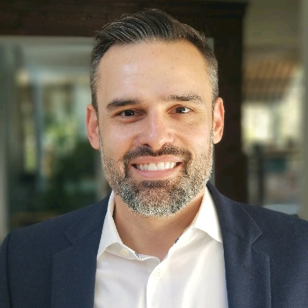

  

# Jason M. Miller
---

## Professional Statement

Strategic business and hands-on technical leader focused on actionable results by leveraging the organization’s most critical asset: **data**. Broad and deep experience across front- and back-office technologies, engineering and infrastructure, Agile delivery, Zero Trust, DevSecOps, AI, and Data Science. Proven track record of creating value through leading nimble cross-functional teams and fostering a culture of cost-effective innovation.

---

## Highlights & Accomplishments

- Led selection, development, and strategy for an enterprise data hub and big data platform, driving increased profitability and operational efficiency across executive and operational levels  
- Developed data governance and business process strategies that reconciled tens of thousands of customer records  
- Modernized complex legacy systems and improved customer experience through custom portals with reporting, analytics, and dashboards  
- Managed qualitative and quantitative customer research initiatives that informed major organizational strategies  
- Applied machine learning to enhance business processes, enabling reallocation of **millions of dollars** in inventory  
- Managed a software enhancement portfolio delivering documented savings in the **millions**  
- Founded an emerging technology hub delivering PoCs in VR training, AI/ML, blockchain, and IoT—spawning multiple follow-on initiatives  
- Recognized thought leader, advisory board member, and speaker on emerging technologies, analytics, and leadership  

---

## Professional Experience

### **RBR Technologies, Inc.**  
*2019 – Present*  
**Clearance:** TS – SCI Eligible  

#### **Technical Lead – Legacy Data Management**  
*Defense Counterintelligence and Security Agency (DCSA), NBIS*  
*2023 – 2025*
- Technical lead for management and migration of legacy data assets  
- Led data migration and integration efforts supporting DCSA’s Integrated Security Services Strategy and **Trusted Workforce 2.0**

#### **Senior Information & Data Engineering Architect**  
*DCSA – Chief Strategy Office (OCDO)*  
*2023*
- Technical lead for data governance and cloud migration of legacy systems  
- Provided reference architectures, best practices, and thought leadership across enterprise data services, architecture, AI, and data science  

#### **Data Scientist**  
*DCSA – PEO Cloud Services & Data Management (CSDM)*  
*2021 – 2023*
- Designed data ingestion, processing, and service patterns for structured and unstructured analytics  
- Developed supervised and unsupervised ML models for prediction and classification  
- Architected PoCs for application authorization, federated identity, cloud engineering, and enterprise data architecture  

#### **Systems Architect**  
*DCSA – PEO CSDM*  
*2020 – 2021*
- Led software engineering for Trusted Workforce 1.25–1.5 Continuous Vetting services  
- Contributed to ServiceNow ATO, RMF, implementation, and governance  

---

### **Air Force Research Laboratory (AFRL)**  
**AI Distributed Systems Software Lead Architect**  
*2019 – 2020*
- Led development of a modular multi-agent AI runtime platform  
- Delivered via Agile methods including daily standups, TEMs, code reviews, and UAT  
- Technologies: C++, Python, ZeroMQ, JSON, PDDL  

---

### **Brink’s, Inc.**  
**Director of Business Intelligence & Analytics – Global Services**  
*2018 – 2019*
- Founded and led the Brink’s Analytics Center of Excellence (BACE) across 41 countries  
- Executed global analytics strategy to improve operational efficiency and evolve business models  
- Enhanced customer experience via automated provisioning and analytics-driven portals  

---

### **Dunbar Armored (Acquired by Brink’s)**  
**Vice President of Applications & Analytics**  
*2015 – 2018*
- Established enterprise technology vision and analytics platform strategy  
- Led digital transformation, application modernization, and advanced analytics initiatives  
- Managed enterprise applications including Dynamics CRM, Workday, Qlik Sense, and Dynamics SL  
- Partnered with executive leadership to translate strategy into measurable KPIs  
- Delivered initiatives including Customer 360, employee retention analytics, operational efficiency, financial digitization, and SaaS modernization  
- Supported Federal Reserve Bank currency supply chain visibility initiatives  

---

### **Dunbar Cybersecurity**  
**Director of Product Management**  
*2012 – 2015*
- Led product strategy based on customer research and market analysis  
- Architected and launched a cloud-based customer service portal  
- Managed branding, marketing campaigns, vendor relationships, and budgets  
- Authored strategic cybersecurity thought leadership content  

---

### **Community Colleges of Baltimore County**  
**Adjunct Faculty – School of Applied & Information Technology**  
*2006 – 2017 (Part-Time)*
- Courses taught: Network+, Security+, A+, Data Communications, PC Hardware & Software  

---

## Additional Experience

- Senior Systems Analyst – Erickson Living Communities  
- IT Manager / Systems Analyst – Retirement Living Television  
- Network Engineer / Information Technologist – McDonogh School  
- Physical Network Technician – University of Maryland Baltimore County  

---

## Board Memberships

- Community Colleges of Baltimore County – Technology Advisory Board  
- Loyola University Maryland – Information Systems & Operations Management Advisory Board  

---

## Education

**University of Maryland Baltimore County (UMBC)**  
- Bachelor of Science in Information Systems – Systems Analysis & Design  
- Graduate Coursework: Deep Learning, Machine Learning, Data Science, Big Data Systems, Systems Engineering, GIS, Project & Engineering Management  

---

## Certifications

- Master’s Certificate in Data Science – UMBC  
- Certified Systems Engineering Professional (CESP) – INCOSE  
- NVIDIA-Certified Associate: AI Infrastructure & Operations  
- NVIDIA-Certified Associate: Generative AI LLMs  
- CompTIA Security+ CE  
- AWS Certified Cloud Practitioner  

---

*References and letters of recommendation available upon request.*
