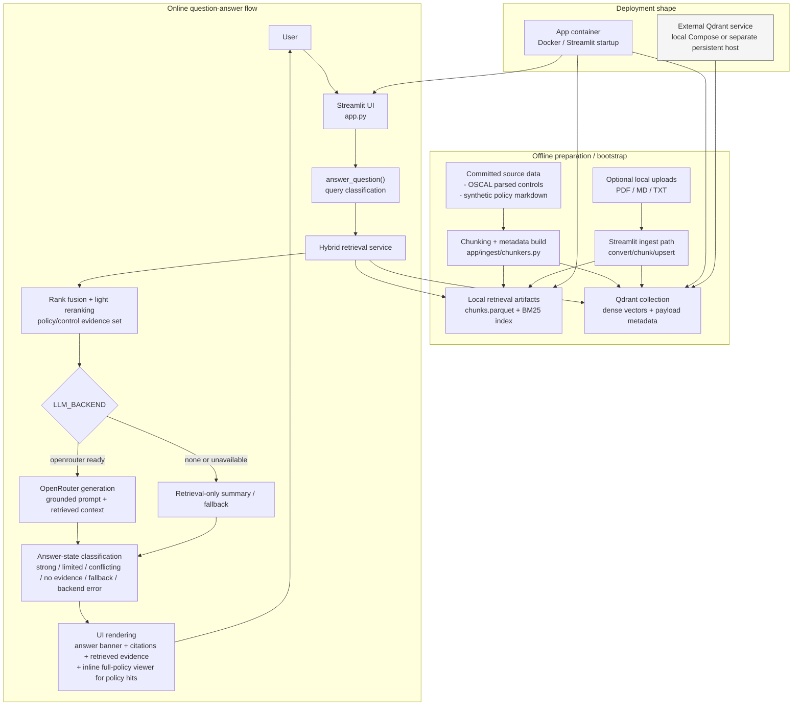

# App Architecture Overview

This Week 7 app is a Streamlit-based RMF/policy assistant that answers questions over committed OSCAL control data and a synthetic policy corpus, with optional live policy uploads for local testing. At runtime it uses hybrid retrieval, combining dense search in Qdrant with local BM25 artifacts, then either returns evidence-grounded excerpts directly or sends the retrieved context to OpenRouter for a grounded explanation. A separate answer-state layer turns the raw result into user-facing states such as strong evidence, limited evidence, conflicting evidence, retrieval-only fallback, no evidence, or backend failure.

## Diagram

## How the App Works

- The app takes two main inputs: user questions in the Streamlit chat UI, and optional local policy uploads from the sidebar.
- The default demo corpus comes from committed OSCAL-derived control data plus committed synthetic policy markdown. These are chunked into a local parquet file and a local BM25 index, and also embedded into Qdrant for dense retrieval.
- `scripts/bootstrap_demo_data.py` and `app/runtime_bootstrap.py` are the main preparation paths. They rebuild `data/index/chunks.parquet`, rebuild the BM25 index, wait for Qdrant, and seed the `rmf_chunks` collection.
- Uploaded files are a local testing convenience. They are converted or normalized into markdown, chunked, upserted into Qdrant, and merged into the local chunk/BM25 artifacts so later questions can retrieve them too.
- Evaluation outputs and truth-table artifacts are mostly outside the normal serving path. They support repeatable experiments and coverage checks, but the day-to-day app flow is question -> retrieval -> optional generation -> answer-state rendering.

## Runtime Answer Flow

- When a user asks a question, `app.py` sends it to `app.rag.answer.answer_question()`.
- The answer module first classifies the question at a high level: policy-focused, framework/control-focused, mixed policy-vs-control, or out-of-scope/abstain-oriented.
- Retrieval then runs through the hybrid retrieval service:
  - dense search in Qdrant using embeddings
  - sparse BM25 search over the local BM25 index
  - reciprocal-rank fusion, plus light policy-aware weighting and reranking
- The retrieved chunks are normalized into citations and a compact context block. Those chunks are the evidence backbone for both retrieval-only mode and OpenRouter mode.
- If `LLM_BACKEND=none`, or OpenRouter is unavailable/misconfigured/failing, the app still returns a retrieval-backed fallback response rather than failing silently.
- If OpenRouter is enabled and healthy, the app sends a grounded prompt plus the retrieved context to the provider and returns a generated explanation that is still tied to citations.
- After that, `derive_answer_view_state()` classifies the result conceptually into:
  - strong supporting evidence
  - limited evidence
  - conflicting evidence
  - no direct evidence
  - retrieval-only fallback
  - backend error or timeout
- The UI then renders:
  - a banner and short summary for the answer state
  - backend/mode details
  - the answer or retrieval fallback text
  - source citations
  - retrieved evidence snippets
  - for policy hits, an inline full-policy viewer and best-effort local source link

## Deployment Shape

- Local reproducible demo path: `docker compose up --build`
  - `qdrant` runs locally
  - `qdrant-bootstrap` seeds the demo corpus
  - `app` starts Streamlit and talks to that Qdrant instance
- Container startup path: `scripts/start_container.py`
  - optionally rebuilds local chunk/BM25 artifacts
  - validates or waits for Qdrant and, by default, the target collection
  - starts Streamlit on `0.0.0.0:$PORT`
- DigitalOcean path:
  - the app runs as a containerized App Platform web service
  - Qdrant runs separately as an external persistent service
  - the app connects through `QDRANT_URL` and optional `QDRANT_API_KEY`
- In the current deployment docs, the primary persistent Qdrant recommendation is a separate DigitalOcean Droplet with Block Storage. Qdrant Cloud is documented as a secondary alternative.

## Current Assumptions / Open Points

- The core serving path depends on both local retrieval artifacts and a reachable Qdrant instance. Dense retrieval is externalized to Qdrant; BM25 and chunk metadata remain local to the app runtime.
- Retrieval-only mode is a first-class operating mode, not just an error case. OpenRouter adds explanation quality when available, but the app is designed to stay usable without it.
- The truth-table and evaluation artifacts are not the main serving architecture, although some mixed policy-vs-control behavior still includes deterministic coverage support tied to those assets.
- Uploaded files are useful for local demos, but they are not durable on App Platform without external storage.
- The architecture is demo-oriented and intentionally simple. It is not trying to be a full multi-service production platform beyond a controlled containerized deployment.
